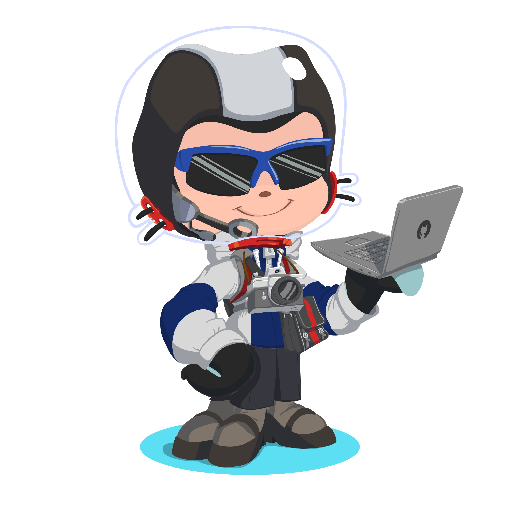

<div align="center">
  <a href="#">
    
  </a>
</div>

<div align="center">
  <picture>
    <source media="(prefers-color-scheme: dark)" srcset="https://capsule-render.vercel.app/api?type=waving&height=200&color=0:00c7ff,100:008bff&text=Kaviya&fontColor=ffffff&fontSize=70&fontAlignY=35&desc=Senior%20Software%20Engineer&descSize=22&descAlignY=60&animation=fadeIn">
    <source media="(prefers-color-scheme: light)" srcset="https://capsule-render.vercel.app/api?type=waving&height=200&color=0:00c7ff,100:008bff&text=Kaviya&fontColor=ffffff&fontSize=70&fontAlignY=35&desc=Senior%20Software%20Engineer&descSize=22&descAlignY=60&animation=fadeIn">
    
  </picture>
</div>

<div align="center">
  <a href="https://git.io/typing-svg">
    
  </a>
</div>

<div align="center">
  
</div>

<p align="center">
  <a href="https://github.com/Kavi-ya?tab=repositories"></a>
  <a href="https://github.com/Kavi-ya?tab=followers"></a>
  <a href="https://github.com/Kavi-ya"></a>
</p>
<div align ="center">
<a href="https://gitroll.io/profile/ughywMoa7FgXHZtzc57gqoe8OcF62" target="_blank"></a>

<div align="center">
  <picture>
    <source media="(prefers-color-scheme: dark)" srcset="https://github.com/Kavi-ya/Kavi-ya/blob/output/github-contribution-grid-snake-dark.svg">
    <source media="(prefers-color-scheme: light)" srcset="https://github.com/Kavi-ya/Kavi-ya/blob/output/github-contribution-grid-snake.svg">
    
  </picture>
</div>

##  About Me



```javascript
// const life = new Coding();
const profile = {
  name: "Kaviya",
  role: "Software Engineer",
  experience: "1+ years",
  languages: ["JavaScript", "TypeScript", "Python", "Java"],
  specialties: ["Full-Stack Development", "Cloud Architecture", "System Design"],
  current_focus: "Building scalable, web-oriented applications",
  education: {
    degree: "Undergraduate of CyberSecurity ",
    interests: ["AI/ML", "Cloud Systems", "Cyber-Security"]},  hobbies: ["Open Source"]};
```

<div align="center">
  <table>
    <tr>
      </td>
    </tr>
  </table>
</div>

##  Technologies & Tools

<p align="center">
  
  
  
  
  
  
  
</p>

<p align="center">
  
  
  
  
  
  
  
</p>

<p align="center">
  
  
  
  
  
  
  
</p>

<p align="center">
  
  
  
  
  
  
</p>

<p align="center">
  
  
  
  
  
</p>

<p align="center">
  
  
  
  
  
</p>

<div align="center">
  
</div>

##  GitHub Stats & Metrics

<div align="center">
  <div style="display: flex; align-items: center; justify-content: center; margin-bottom: 15px;">
    
    <b style="margin: 0 10px;">62</b> Stars Earned
    
    <b style="margin: 0 10px;">521</b> Total Commits (2025)
    
    <b style="margin: 0 10px;">98</b> Pull Requests
  </div>
  
  <div style="display: flex; align-items: center; justify-content: center; margin-bottom: 15px;">
    
    <b style="margin: 0 10px;">39</b> Issues Created
    
    <b style="margin: 0 10px;">874</b> Total Contributions
    
    <b style="margin: 0 10px;">8</b> Repositories Contributed
  </div>
</div>

<div class="stats-container" align="center">
  <div style="display: grid; grid-template-columns: repeat(2, 1fr); gap: 20px; margin-bottom: 20px;">
    <div style="border: 1px solid #2d333b; border-radius: 8px; padding: 16px;">
      <h3 align="center" style="margin-top: 0;">Activity Timeline</h3>
      <p align="center">
        
      </p>
    </div>
    <div style="border: 1px solid #2d333b; border-radius: 8px; padding: 16px;">
      <h3 align="center" style="margin-top: 0;">Language Distribution</h3>
      <p align="center">
        
      </p>
    </div>
  </div>
  
  <div style="display: grid; grid-template-columns: repeat(3, 1fr); gap: 10px;">
  <div style="background: linear-gradient(145deg, #101217, #1d212e); border-radius: 8px; padding: 16px; text-align: center; box-shadow: 0 4px 10px rgba(0,0,0,0.1);">
      <h3 style="margin-top: 0; color: #00c7ff;">874</h3>
      <p>Total Contributions</p>
      <small>May 28, 2020 - Present</small>    </div>
    
  <div style="background: linear-gradient(145deg, #101217, #1d212e); border-radius: 8px; padding: 16px; text-align: center; box-shadow: 0 4px 10px rgba(0,0,0,0.1);">
      <h3 style="margin-top: 0; color: #00c7ff;">2</h3>
      <p>Current Streak</p>
      <small>Aug 10 - Aug 11</small>
    </div>
  
  <div style="background: linear-gradient(145deg, #101217, #1d212e); border-radius: 8px; padding: 16px; text-align: center; box-shadow: 0 4px 10px rgba(0,0,0,0.1);">
      <h3 style="margin-top: 0; color: #00c7ff;">11</h3>
      <p>Longest Streak</p>
      <small>Mar 28 - Apr 7</small>
    </div>
  </div>
</div>

<details>
  <summary>🏆 Achievements</summary>

  
  
</details>

##  Featured Projects

<div align="center">
  <a href="https://github.com/Kavi-ya/Greenhouse-Automation">
    
  </a>
  <a href="https://github.com/Kavi-ya/Exam-Management-System">
    
  </a>
</div>

<div align="center">
  <p><i>View more projects in my repositories</i></p>
  <a href="https://github.com/Kavi-ya?tab=repositories">
    
  </a>
</div>

<div align="center">
  
</div>

##  Connect With Me

<div align="center">
  <a href="https://linkedin.com/in/kaviya" target="https://www.linkedin.com/in/kavindu-sahan-silva/">
    
  </a>
  <a href="https://twitter.com/kaviya" target="_blank">
    
  </a>
  <a href="https://discord.gg/kaviya" target="_blank">
    
  </a>
  <a href="https://stackoverflow.com/users/12345678" target="_blank">
    
  </a>
  <a href="mailto:kavindusahansilva@gmail.com">
    
  </a>
</div>

<br>

<div align="center">
  <a href="https://www.buymeacoffee.com/kaviya" target="_blank">
    
  </a>
</div>

<div align="center">
  
</div>

<div align="center">
  <picture>
    <source media="(prefers-color-scheme: dark)" srcset="https://capsule-render.vercel.app/api?type=waving&section=footer&height=100&color=0:008bff,100:00c7ff">
    <source media="(prefers-color-scheme: light)" srcset="https://capsule-render.vercel.app/api?type=waving&section=footer&height=100&color=0:008bff,100:00c7ff">
    
  </picture>
</div>
